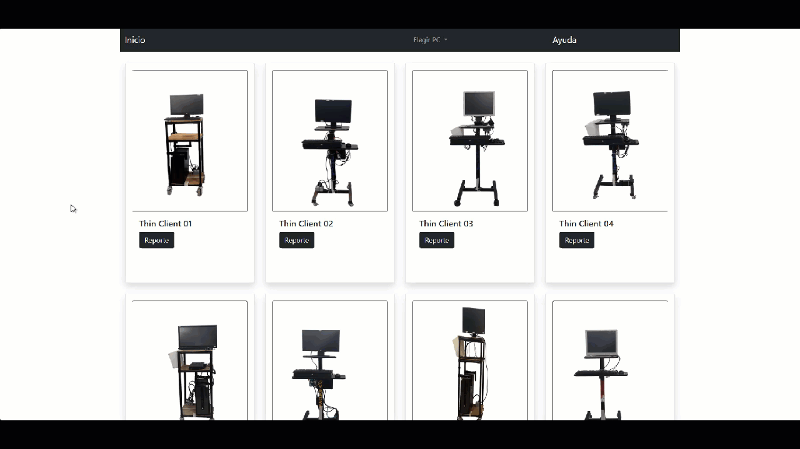
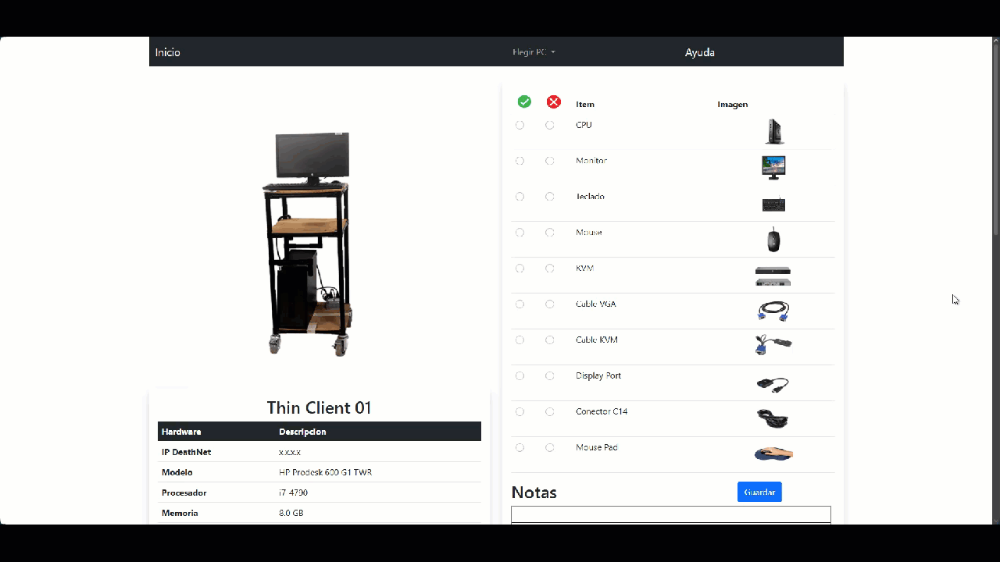
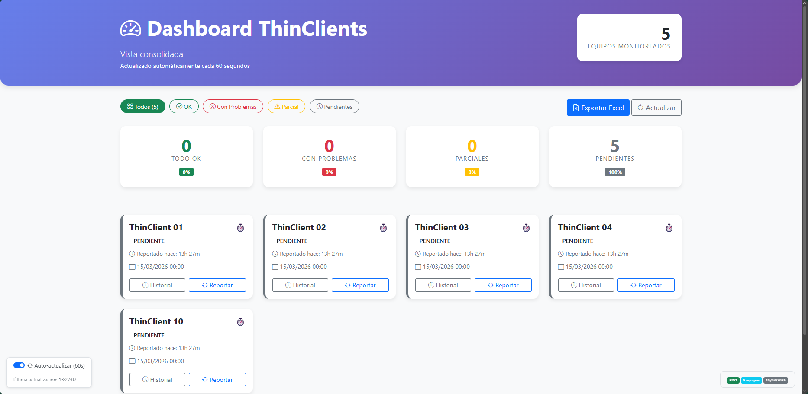
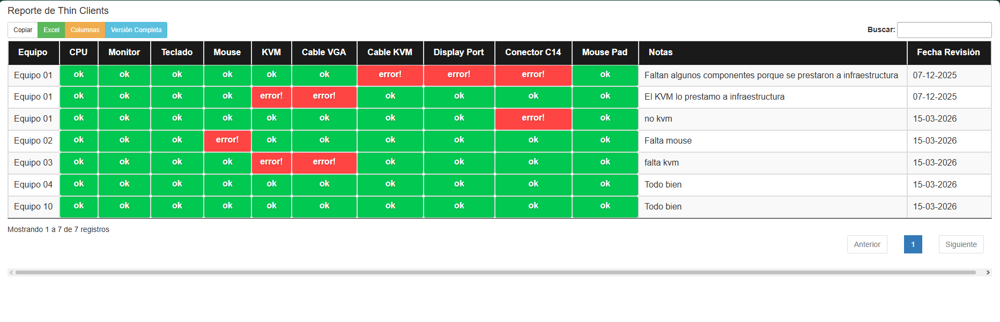

# 🖥️ Hardware Status Report System

A fast, no-login web application for reporting the physical condition of thin client workstations in manufacturing and data center environments. Designed to deliver a complete hardware status check in under 5 minutes, with results visible in real time to engineers from their workstations.

---

## 📸 Screenshots

| Home(GIF) | Device Report(GIF) |
|:---:|:---:|
|  |  |

| Dashboard(screenshot) | DataTables(screenshot) |
|:---:|:---:|
|  |  |

---

## 🎯 Problem It Solves

In environments with recurring idle periods (2 to 6 weeks between active cycles), returning to work often meant discovering missing or damaged hardware — KVM switches, DB9 console ports, VGA cables, power connectors — with no record of when the damage occurred or what the previous state was.

The standard approach was slow: an Sr. Engineer would ask a Jr. Engineer, who would ask technicians, who would walk the floor and report back verbally or on paper. By the time the information reached the engineer, it was incomplete, inconsistent, and not actionable.

This system compresses that entire workflow into a single session:

```
Sr. Engineer requests status
    └── Jr. Engineer assigns technicians
            └── Technicians open the app, check each component, submit
                    └── Sr. Engineer sees results instantly in a filterable table
                            └── Exports to Excel and sends by email
Total time: under 5 minutes
```

---

## 🚀 Features

- **360° photo gallery per device** — real photographs of each physical workstation taken on-site, allowing anyone to visually identify missing or damaged components without prior knowledge of the equipment
- **Component checklist** — per-device form covering CPU, monitor, keyboard, mouse, KVM, VGA cable, KVM cable, DisplayPort, C14 connector, and mousepad
- **Quick report** — one-click status submission (OK / Error / Partial) for fast turnaround when full detail isn't needed
- **Real-time DataTables view** — all submitted reports visible instantly in a filterable, searchable table
- **Excel export** — download the current status as `.xlsx` for email distribution
- **Dashboard** — Sr. Engineer view showing the latest status of all devices at a glance, color-coded by condition
- **No login required** — intentional design decision for a LAN-only internal tool where speed and accessibility outweigh authentication overhead
- **Inline user manual** — built-in help page with GIF walkthroughs for each feature

---

## 🎨 Design Decisions

**Why no login?**

The system was designed for a controlled internal network with a specific operational constraint: the status report had to happen fast, with whoever was available on the floor. Login screens mean forgotten passwords, uncreated accounts, and friction at exactly the moment you need speed. On a LAN-only tool where the goal is a 5-minute turnaround, that tradeoff was clear.

**Why real photos?**

Generic icons don't tell you if a KVM cable is missing from *this specific machine*. Real 360° photographs of each physical device mean any technician — including someone from a different area who has never worked with that equipment — can look at the photo and immediately see what's there and what isn't. The photo is the report.

---

## 🛠️ Tech Stack

| Layer | Technology |
|---|---|
| Backend | PHP 8+ (PDO) |
| Database | MySQL / MariaDB |
| Frontend | HTML5, Bootstrap 5, Font Awesome |
| Tables | jQuery DataTables (with Excel export) |
| Photo gallery | jQuery Swipebox (360° view) |

---

## 📁 Project Structure

```
hardware-report/
├── config.php               # Local credentials — not in version control
├── config.example.php       # Configuration template
├── conexion.php             # PDO database connection
├── index.php                # Main page — device grid with 360° photo thumbnails
├── dashboard.php            # Real-time status dashboard for Sr. Engineers
├── datatables2.php          # DataTables report view (iframe-embedded)
├── guardar_rapido.php       # Quick-save API endpoint (JSON)
├── borrar.php               # Record management
├── ayuda.php                # Built-in user manual with GIF walkthroughs
├── reporte.sql              # Database schema
├── header_footer/
│   ├── header.php           # Shared navigation
│   └── footer.php           # Shared footer
├── paginas/
│   └── pc01.php … pc13.php  # Per-device report pages with checklist + photos
├── formulario/
│   └── tabla_pc01.php       # Reusable checklist form component
├── img/
│   ├── pc01/ … pc13/        # 360° photo sets per device
│   └── [component icons]    # CPU, monitor, keyboard, mouse, KVM, cables...
└── .gitignore
```

---

## ⚙️ Installation

### Requirements

- PHP 8.0+
- MySQL 5.7+ or MariaDB 10.4+
- Apache or Nginx
- Modern browser — no installation on client machines

### Steps

1. **Clone the repository**
   ```bash
   git clone https://github.com/fmartinez-cli/hardware-report.git
   cd hardware-report
   ```

2. **Create the database**
   ```bash
   mysql -u root -p -e "CREATE DATABASE hardware_report CHARACTER SET utf8mb4;"
   mysql -u root -p hardware_report < reporte.sql
   ```

3. **Configure the connection**
   ```bash
   cp config.example.php config.php
   ```
   Edit `config.php` with your database credentials and server URLs.

4. **Access the application**
   ```
   http://your-server/hardware-report/
   ```

---

## 🗄️ Database — Key Table

| Column | Type | Description |
|---|---|---|
| `id` | int | Auto-increment primary key |
| `thinclient` | varchar | Device identifier (e.g. TC-01) |
| `cpu` | varchar | CPU status: `ok` or `error!` |
| `monitor` | varchar | Monitor status |
| `teclado` | varchar | Keyboard status |
| `mouse` | varchar | Mouse status |
| `kvm` | varchar | KVM switch status |
| `cablevga` | varchar | VGA cable status |
| `cablekvm` | varchar | KVM cable status |
| `displayport` | varchar | DisplayPort adapter status |
| `conector14` | varchar | C14 power connector status |
| `mousepad` | varchar | Mousepad status |
| `notaCPU` | varchar | Technician notes |
| `fregis` | date | Report date |
| `created_at` | timestamp | Exact submission time |

---

## 👤 User Roles

| Role | Access |
|---|---|
| Technician | Opens device page, completes checklist or quick report, submits |
| Jr. Engineer | Assigns technicians, monitors DataTables view per bay |
| Sr. Engineer / Leader | Dashboard view — latest status of all devices, Excel export |

No authentication required — access is controlled at the network level (LAN only).

---

## 🔒 Security Notes

- No login by design — intended for controlled internal LAN environments only
- Database credentials are stored in `config.php` which is excluded from version control
- All database queries use PDO with prepared statements
- **Not recommended for public internet deployment** without adding authentication

---

## 🤝 Contributing

Pull requests are welcome. For major changes, please open an issue first.

1. Fork the repository
2. Create a feature branch (`git checkout -b feature/my-feature`)
3. Commit your changes (`git commit -m 'feat: description'`)
4. Push and open a Pull Request

---

## 📄 License

This project is licensed under the [MIT License](LICENSE).

---

## 👨‍💻 Author

**Fernando Martinez Barbosa**
- LinkedIn: www.linkedin.com/in/fernando-martinez-barbosa-643894142
- GitHub: [@fmartinez-cli](https://github.com/fmartinez-cli)

---

> _Built around a simple insight: a real photo of the actual machine tells you more than any form ever could._
